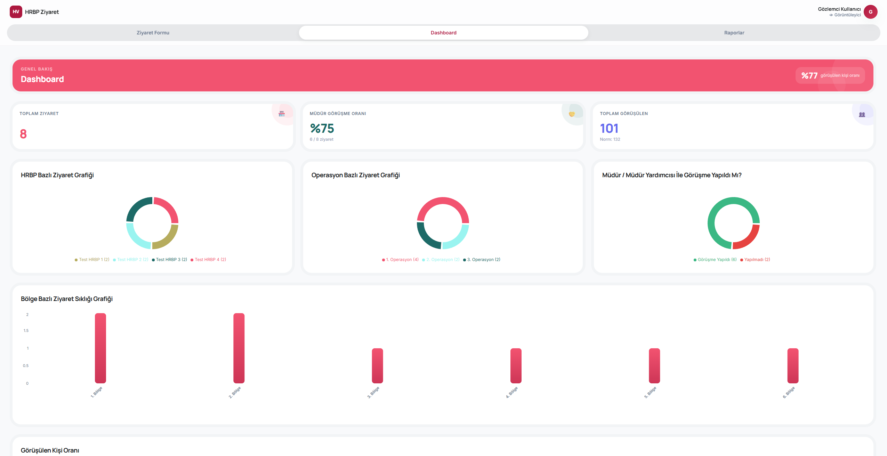

# Mağaza Ziyaret Formu

HRBP'lerin mağaza ziyaretlerini kayıt altına aldığı, yöneticilerin raporları takip edebildiği web uygulaması.

### https://magazaziyaret.wolee.cloud/ 
> Login: viewer@test.com / viewer123



## Özellikler

- HRBP'ler ziyaret formu doldurabilir (operasyon → bölge → mağaza zinciri)
- Admin tüm ziyaretleri görür, HRBP yalnızca kendi kayıtlarını
- Viewer rolü formu görüntüler ama kayıt yapamaz
- Dashboard ile özet istatistikler ve grafikler
- Raporlar sayfasında filtreleme ve Excel'e aktarım
- Admin panelinde kullanıcı yönetimi
- Karanlık / açık tema desteği

## Teknolojiler

**Frontend:** React 19, Vite, Tailwind CSS v4, Recharts, React Hook Form, Zod

**Backend:** Node.js, Express, sql.js (SQLite), JWT, bcryptjs

## Kurulum

### Gereksinimler

- Node.js 18+

### Frontend

```bash
cd hrbp-app
cp .env.example .env.development
npm install
npm run dev
```


## Kullanım

Uygulama varsayılan olarak mock mod (`VITE_USE_API=false`) ile çalışır — backend gerekmez.

Backend'i aktif etmek için `hrbp-app/.env.development` dosyasında:

```
VITE_USE_API=true
VITE_API_URL=http://localhost:5000/api
```

## Roller

| Rol | Yetki |
|-----|-------|
| `admin` | Tüm ziyaretler, kullanıcı yönetimi |
| `hrbp` | Kendi ziyaretleri, form doldurma |
| `viewer` | Salt okunur erişim |

## Proje Yapısı

```
├── backend/          # Express API + SQLite
│   ├── server.js
│   ├── db.js
│   └── .env.example
└── hrbp-app/         # React frontend
    ├── src/
    │   ├── pages/
    │   ├── components/
    │   ├── context/
    │   ├── services/
    │   └── data/
    └── .env.example
```
